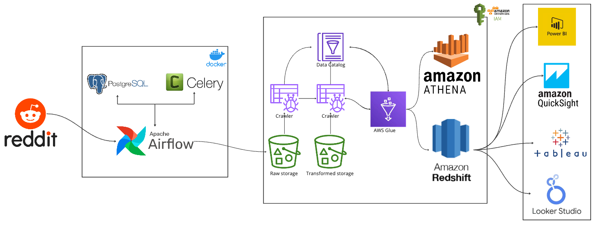

# Reddit Data Engineering Pipeline
## Orchestrated with Airflow, Celery, Postgres, S3, AWS Glue, Athena, and Redshift

This project implements a robust ETL pipeline to extract, transform, and load Reddit data into an AWS Redshift data warehouse. It utilizes a modern data engineering stack including Apache Airflow for orchestration, S3 for data lake storage, and AWS Glue/Athena for transformations.

## Table of Contents

- [Overview](#overview)
- [Architecture](#architecture)
- [Prerequisites](#prerequisites)
- [System Setup](#system-setup)

## Overview

The pipeline automates the following workflow:

1. **Extraction**: Pulling data from Reddit using the PRAW (Python Reddit API Wrapper).
2. **Staging**: Storing raw JSON/CSV data into an Amazon S3 bucket.
3. **Transformation**: Processing and cleaning data using AWS Glue and Amazon Athena.
4. **Loading**: Moving the structured data into Amazon Redshift for analytics.

## Architecture


1. **Reddit API**: Data source.
2. **Apache Airflow & Celery**: Workflow management and task execution.
3. **PostgreSQL**: Metadata storage for Airflow.
4. **Amazon S3**: Raw and processed data storage.
5. **AWS Glue**: Metadata cataloging.
6. **Amazon Athena**: Serverless SQL transformations.
7. **Amazon Redshift**: Scalable data warehousing.

## Prerequisites
- AWS Account with S3, Glue, Athena, and Redshift access.
- Reddit Developer Account (API credentials).
- Docker & Docker Compose.
- Python 3.9+

## System Setup

1. **Clone the repository**:
   ```bash
   git clone <your-repo-url>
   ```

2. **Configure Credentials**:
   Rename the example config and add your API/AWS keys:
   ```bash
   # Already done in this setup
   # Edit config/config.conf with your credentials
   ```

3. **Start the environment**:
   ```bash
   docker-compose up -d
   ```

4. **Access Airflow**:
   Navigate to `http://localhost:8080` (Default: admin/admin)

## Author
**Waleed Ali**
- GitHub: [Waleed-Alii](https://github.com/Waleed-Alii)
